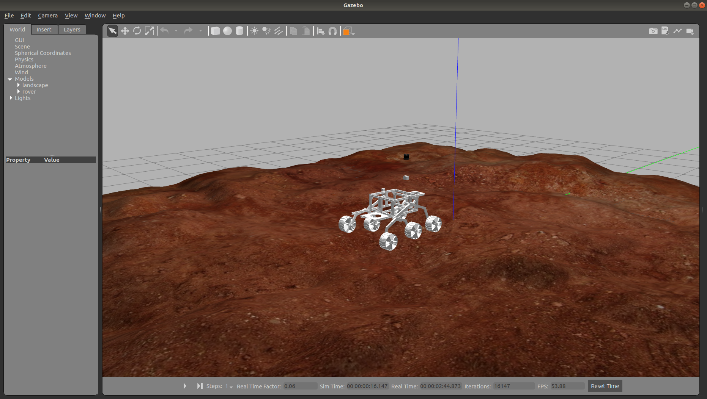
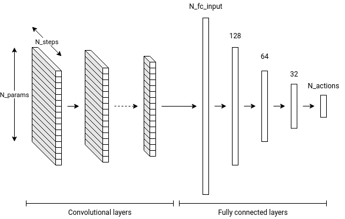
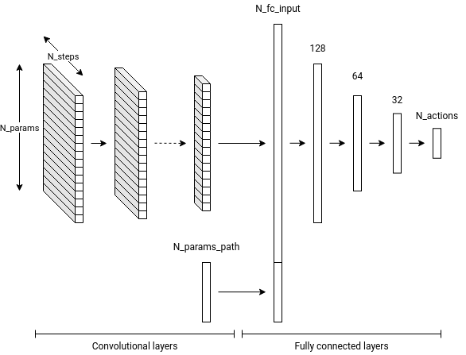
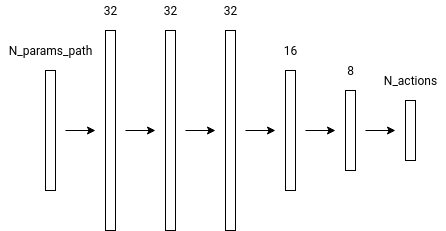
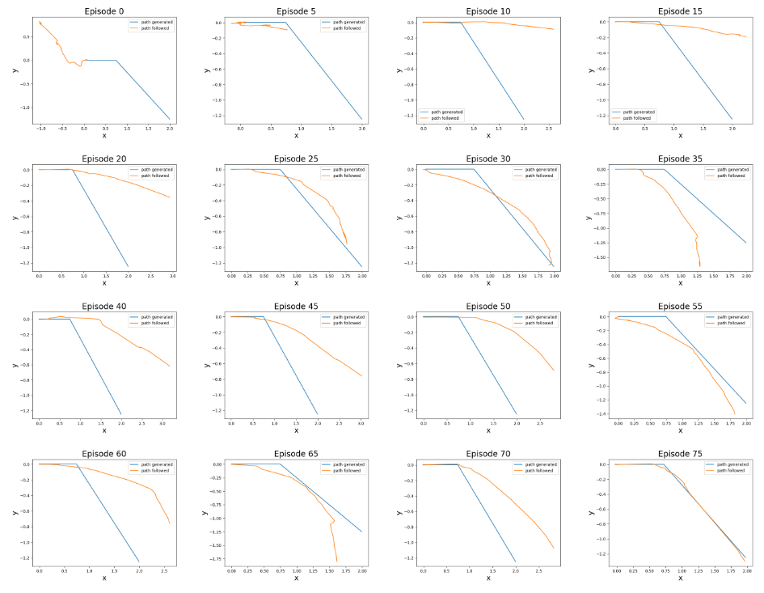

# Blind Local Planner

In the scope of a rover competition, the Xplore association at EPFL is partipating and building a rover. In this scope, one of the tasks that the rover has to complete, is to move autonomosly to a given landmark inside an arena with martian-like terrain. This project works in particular on a path follower and obstacle avoidance method implemented in a simulation.



The main repository for the work of the navigation team on the rover can be found [here](https://github.com/EPFLXplore/main_NAV_ws).\
This repository only contains the part needed for the implementation of the path follower with obstacle avoidance and is based on the toolkit **OpenAI Gym** adapted in order to work with the **Gazebo** simulator and **ROS**. The code works in conjunction with a [workspace](https://github.com/ljacqueroud/rover_catkin_ws), which contains all the ROS packages for the simulation itself.


# The path follower

The idea of this project is to not rely only on a Lidar present on the rover for the navigation, and therefore to use the internal sensors to detect and react to unexpected problems, such as smaller obstacles that weren't detected by the Lidar. In order to do that, a reflex based approach is implemented through a deep neural network. The objective is for the network to learn in simulation, how to react to small rocks/holes in order to reach a given goal in the optimal way, and later to transfer it on the real rover.

The neural network is a **TCN** (Temporal Convolutional Network) followed by a fully connected network. The architecture is as follows:



The inputs are the data from an IMU, potentiometers which give the joint positions and wheel velocities from wheel encoders. As it needs to learn if the rover is stuck, a few seconds of data are given by taking the last _N_ time steps for each of them. The output are a predefined set of commands that the rover can execute (such as go forward, turn left, ...).

A path is automatically computed, but in order to reach the goal a path follower has to be also implemented. Here the possibility of incorporating the path follower in the neural netowrk is explored. In order to do that, the path information and the rover position are given as input to the fully connected part:



In order to test if a path follower can be implemented with a fully connected network, the following smaller network was tested:



With a fixed path (giving a constant goal at each training session), the network is able to learn to follow it as can be seen in the following plots



The next steps in this project are to test the fully connected network on a general path, by randomizing the goal at each iteration, and afterwards to test the complete network presented before with the TCN part in order to achieve obstacle avoidance through reflexes.


# Technical details

### 1. Setup

Install the following packages:
```
sudo apt install \
ros-melodic-desktop-full \
python-pip \
python3-vcstool python3-pyqt4 pyqt5-dev-tools \
libbluetooth-dev libspnav-dev pyqt4-dev-tools libcwiid-dev \
cmake gcc g++ qt4-qmake libqt4-dev libusb-dev libftdi-dev \
python-defusedxml \
ros-melodic-octomap-msgs ros-melodic-joy ros-melodic-geodesy ros-melodic-octomap-ros         \
ros-melodic-control-toolbox ros-melodic-pluginlib ros-melodic-trajectory-msgs ros-melodic-control-msgs	       \
ros-melodic-std-srvs ros-melodic-nodelet ros-melodic-urdf ros-melodic-rviz		       \
ros-melodic-kdl-conversions ros-melodic-eigen-conversions ros-melodic-tf2-sensor-msgs     \
ros-melodic-pcl-ros ros-melodic-navigation ros-melodic-sophus \
ros-melodic-ros-control ros-melodic-ros-controllers ros-melodic-roslint \
ros-melodic-robot-state-publisher ros-melodic-pcl-ros ros-melodic-tf-conversions \
python-catkin-tools \
ros-melodic-joint-state-publisher-gui \
libeigen3-dev \
ros-melodic-grid-map ros-melodic-tf2-sensor-msgs \
ros-melodic-navigation ros-melodic-ar-track-alvar
```

and with pip
```
sudo python -m pip install gym
```

- clone [catkin workspace repo](https://github.com/ljacqueroud/rover_catkin_ws)
- go to root of `rover_catkin_ws` (cd `rover_catkin_ws`)
- `catkin_make`
- add `source catkin_ws/devel/setup.bash` to `.bashrc` (found in `/home/user`)
- add `export ROS_MASTER_URI=http://localhost:11311` to `.bashrc`
- add `export GYM_GAZEBO_WORLDS_PATH=/path_to_this_repo/gym_gazebo/gym_gazebo/envs/assets/worlds` to `.bashrc` (change `path_to_this_repo` with the correct path)
- clone this repo
- go to root of this repo (cd `gym_gazebo`)
- `sudo pip install -e .`
**WARNING** when using `catkin_make` make sure other workspaces are not sourced!

also it is recommended to add the following alias in the `.bashrc` in order to close all ROS and gazebo processes with the command `killros`:\
`alias killros='killall -9 rosout roslaunch rosmaster gzserver nodelet robot_state_publisher gzclient'`


___
### 2. Run the code

- cd `examples/rover`
- `python rover_main.py`

The main files for the training are:
- `/examples/rover/rover_main.py`: main script containing the training loop
- `/examples/rover/dnn.py`: file containing the definition of the neural networks
- `/gym-gazebo/envs/rover/rover_gazebo_env.py`: file containing the environment definition


___
###  3. Helpful modifications

##### 3.1 GUI

Open GUI automatically when launching:\
in launch file `gym-gazebo/gym-gazebo/envs/assets/launch`
set `<arg name="gui" default="true">`

##### 3.2 Create new gym environment

- in main script: call `env = gym.make('MyNewEnvironment-v0')`
- in environment definition (`gym-gazebo/gym-gazebo/envs`): create new environment
- in `gym-gazebo/gym-gazebo/__init__.py` register new environment with id (name) and entry point (env class defined in last point)
- in launch files definition (`gym-gazebo/gym-gazebo/envs/assets/launch`): create new launch file


##### 3.3 Change world

World file in `gym-gazebo/gym-gazebo/envs/assets/worlds`\
In corresponding launch file (`gym-gazebo/gym-gazebo/envs/assets/launch`) change
`<arg name="world_file"  default="$(env MY_WORLD_PATH)"/>`\
In world file, link to corresponding mesh (dae file): `<mesh><uri>file:///path_to_my_world</uri></mesh>`


##### 3.4 Change robot model (URDF)

Urdf file in `catkin_ws/src/rover/rover_description/urdf`\
or `gym-gazebo/gym_gazebo/envs/assets/urdf`\
In corresponding launch file (`gym-gazebo/gym-gazebo/envs/assets/launch`) change `<arg name="urdf_file"  default="$(env MY_URDF_PATH)"/>`\


##### 3.5 Access internal sensor data

- IMU topic: `os1_cloud_node/imu/...`
- Joint angles: `rover/joint_states` (for each join: position, velocity, effort) or `gazebo/link_states` (for each link: position (x,y,z), orientation (x,y,z,w) linear (x,y,z), angular (x,y,z)


##### 3.6 Change verbose level

In `$ROS_ROOT/config/rosconsole.config` set verbose to `DEBUG`,`INFO`,`WARN`,`ERROR`,`FATAL`

___
### 4. Helpful Paths

- examples:\
  `gym-gazebo/examples`
- environments:\
  `gym-gazebo/gym-gazebo/envs`
- worlds:\
  `gym-gazebo/gym-gazebo/envs/assets/worlds`
- robots (turtlebot):\
  `catkin_ws/src/turtlebot/turtlebot_description/robots`
- bash setups:\
  `gym-gazebo/gym-gazebo/envs/installation`
- launch files:\
  `gym-gazebo/gym-gazebo/envs/assets/launch`


- urdf launch:\
  `catkin_ws/src/turtlebot_simulator/turtlebot_gazebo/launch/includes`
- world launch:\
  `catkin_ws/src/gazebo_ros_pkgs/gazebo_ros/launch`

___
### 5. Notes

This repo was forked from the [gym gazebo repo](https://github.com/erlerobot/gym-gazebo). All the examples are kept inside the `examples` folder and can be run if desired. Follow the instructions from that repository in order to do so.
